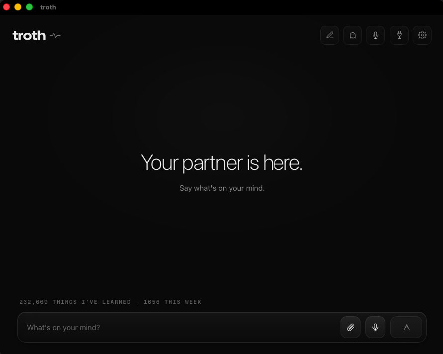

  

  
  
  
  

 

  

  <b>232,669</b> things learned &nbsp;·&nbsp; on one machine &nbsp;·&nbsp; still there after every model swap

 
 

## The idea

Every assistant I used kept its memory of me inside someone else's account.
Switch models and it's gone. Cancel the subscription and it's gone. The thing
that knew how I work was never actually mine.

So I moved the memory to my own machine and made the model the part you can
throw away.

**troth** keeps its identity, memory, goals and refusal rules in a SQLite
substrate on your hardware. The language model underneath is interchangeable —
Claude, ChatGPT, Kimi, or one running entirely offline. Swap the engine and the
partner is unchanged, because the mind was never in the model.

 

## What that buys you

<table>
<tr>
<td width="50%" valign="top">

**Memory that survives**

Sessions, restarts, model swaps. What it learned on Claude is still there when
you run a local model with no internet at all.

</td>
<td width="50%" valign="top">

**Your keys, never seen**

The model receives the result of an API call, never the credential that made it.
A prompt that asks for your keys gets nothing — there was nothing to reveal.

</td>
</tr>
<tr>
<td width="50%" valign="top">

**Nothing leaves the machine**

No telemetry, no analytics, no account to sync to. Delete the database and it
forgets, completely and immediately.

</td>
<td width="50%" valign="top">

**Open core**

The substrate, router, proxy, CLI and MCP servers are AGPL and free forever.
The macOS app is what funds the work.

</td>
</tr>
</table>

 

## Checkable, not claimed

|  |  |
|---:|:---|
| **1,696** | tests running in CI on every push |
| **0** | telemetry calls in the open core |
| **1** | payment, then twelve months of updates — no subscription |

 

  <a href="https://github.com/xgre1/troth"><b>Read the code</b></a>
  &nbsp;·&nbsp;
  <a href="https://troth.one"><b>Get the app</b></a>
  &nbsp;·&nbsp;
  <a href="https://troth.one/technical">Technical detail</a>
  &nbsp;·&nbsp;
  <a href="https://troth.one/security">Security</a>

  I build software that keeps working when the company behind it stops.

<!-- profile -->
